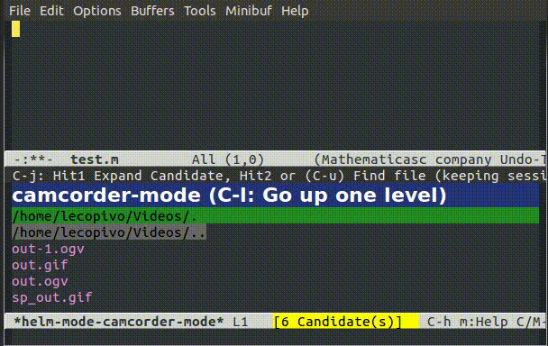

# Wolfram-mode

This provides basic editing features for Wolfram Language
(http://reference.wolfram.com/language/), based on `math++.el'
(http://chasen.org/~daiti-m/dist/math++.el).

You should add the followings to `~/.emacs.d/init.el'.

 (autoload 'wolfram-mode "wolfram-mode" nil t)
 (autoload 'run-wolfram "wolfram-mode" nil t)
 (setq wolfram-program "/Applications/Mathematica.app/Contents/MacOS/MathKernel")
 (add-to-list 'auto-mode-alist '("\\.m$" . wolfram-mode))
 (setq wolfram-path "direcotry-in-Mathematica-$Path")  ;; e.g. on Linux "~/.Mathematica/Applications"

## wolfram-run-script

You can call function `EPrint[expr]` in Mathematica code to get pretty printing of `expr` in Emacs

